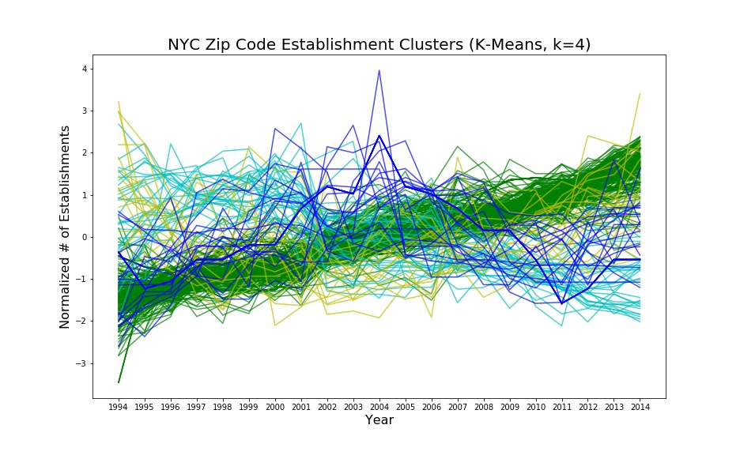
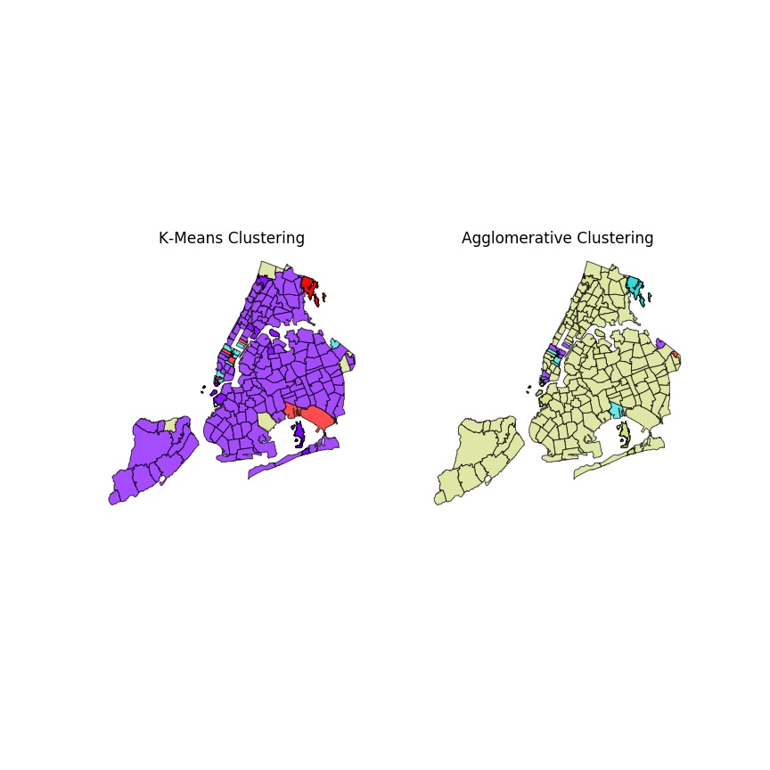

# PUI2018 HW 12
December 13, 2018

### Assignment 1. [Subway Timeseries Part 2](../HW12_zem232/HW12_zem232_MTA_Time_Series.ipynb) 
This is a continuation of the subway timeseries assignment in HW11. I will examine outliers, trends and periodicity of MTA subway swipes. I worked on this assignment on my own.

### Assignment 2. [NYC Economic Development Timeseries Clustering](../HW12_zem232/HW12_zem232_ZipCode_Clustering.ipynb)
I worked on this assignment on my own. 
In this assignment, we investigated trends in NYC economic development by clustering patterns in the number of establishments in NYC zip codes using K-means and Agglomerative clustering (Sklearn).

**NYC Paying Establishments Time Series (Clustered w/ K-means)** Using K-Means clustering to evaluate trends in the total count of NYC establishments by Zip Code.

**K-Means vs. Agglomerative** Comparing clustering techniques K-means on the left, and agglomerative on the right. The trends are very similar, however the k-means method attempts to create similarly-sized clusters, while the agglomerative method groups the majority of zip codes into one cluster. The general trends that both methods indicate is a generally increasing number of establishments in NYC, with a few other zip codes that exhibit different patterns.

**Discussion**
The increasing trend in NYC makes sense, as the city is becoming more densely populated and more efficient at occupying space. Additionally, there are zip codes showing a generally decreasing trend (blue zip codes on left, purple and red on the right) and are mostly located in Midtown or Downtown Manhattan. This could be attributed to horizontal integration, where establishments are growing in size and therefore indicating fewer establishments. This could also be attributed to these areas becoming more residential and there actually are fewer establishments in these areas.

Another common trend among the two methods are the clusters with peak establishment count in the middle of the time series (red on left, blue on right). These areas are either located in Midtown Manhattan or near JFK in Bk/Queens, as well as near Westchester counter in the Bronx. It is difficult to find an interpretation of this trend since I cannot seem to find the common ground of these areas.

One interesting difference between the two methods is that K-Means includes a cluster with a lowpoint in the middle of the timeseries (yellow cluster on the left). In the agglomerative cluster method, this absence is absorbed by the general increasing trend cluster. These areas are quite spread out along the periphery of the city in North Staten Island, South Brooklyn, Eastern Queens and North Bronx. These areas are probably not very stable locations for businesses. Businesses may have been affected by the Dotcom bubble / global financial crisis, or some other event that rocked the economy.

