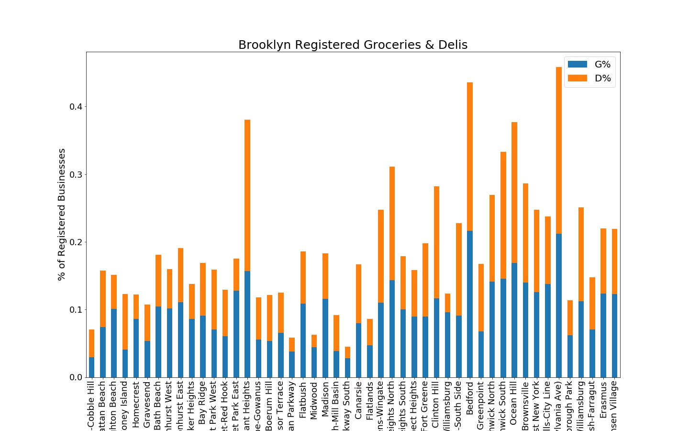

# PUI2018 HW 12
December 13, 2018

### Assignment 1. [Subway Timeseries Part 2](../HW12_zem232_MTA_Time_Series.ipynb) 
This is a continuation of the subway timeseries assignment in HW11. I will examine outliers, trends and periodicity of MTA subway swipes. I worked on this assignment on my own.

### Assignment 2. [NYC Economic Development Timeseries Clustering](../HW12_zem232_ZipCode_Clustering.ipynb)
In this assignment, we investigated trends in NYC economic development by clustering patterns in the number of establishments in NYC zip codes using K-means and Agglomerative clustering (Sklearn).

I worked on this assignment on my own. 

