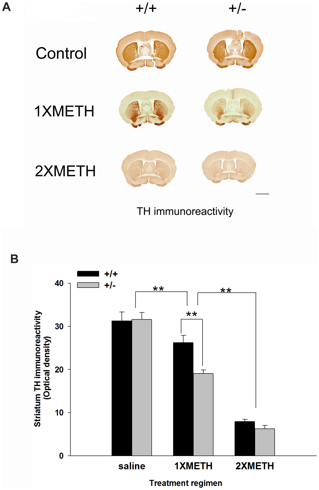

# PUI2018 HW 6 completed by Zoe Martiniak

## ASSIGNMENT 1:
See the CitibikeReview_zem232.md https://github.com/anaelisa24/PUI2018_amm1209/tree/master/HW4_amm1209

## ASSIGNMENT 2: Literature choices of statistical tests

### TWO-WAY ANOVA
Luo, Y., Wang, Y., Kuang, Chiang, Y.H., Hoffer, B. 2010. Decreased Level of Nurr1 in Heterozygous Young Adult Mice Leads to Exacerbated Acute and Long-Term Toxicity after Repeated Methamphetamine Exposure. PLOS ONE. Available at: https://doi.org/10.1371/journal.pone.0015193 

Summary: Compared to naive mice that recieved methamphetamine (METH) doses for the first time, mice with adolescent exposure to METH showed a greater loss of tyrosine hydroxylase immonoreactivity in striatum, loss of THir fibers in the substantia nigra reticulata & decreased dopamin transpirter level. The results of this study indicate that adolescent binge exposure in adolescent mice causes chronic, adverse effects on and greater overall damage to the dopaminergi system than when mice use METH after adolescence.

| **Statistical Analyses**	|  **IV(s)**  |  **IV type(s)** |  **DV(s)**  |  **DV type(s)**  |  **Control Var** | **Control Var type**  | **Question to be answered** | **_H0_** | **alpha** | **link to paper**| 
|:----------:|:----------|:------------|:-------------|:-------------|:------------|:------------- |:------------------|:----:|:-------:|:-------|
|ANCOVA	| 1, Ranks of values | numerical | 1, did Self Affirmation or no| categorical | 1, age of mice | continuous (could also be categorical) | 	Do mice exposed to meth in adolescence experience more adverse health effects than mice using meth after adolescence?? | Ranks test groups <= Ranks control group | 0.001 | [Decreased Level of Nurr1 in Heterozygous Young Adult Mice Leads to Exacerbated Acute and Long-Term Toxicity after Repeated Methamphetamine Exposure](https://journals.plos.org/plosone/article?id=10.1371/journal.pone.0015193) |
  |||||||||
  
  
  

