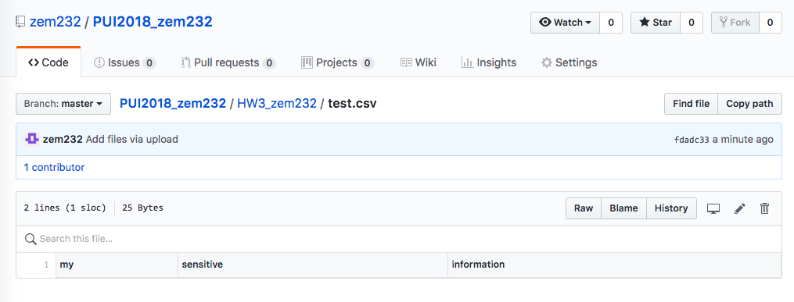
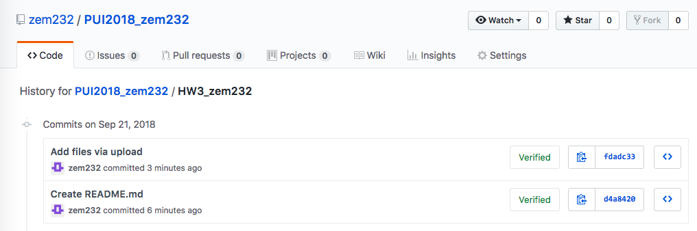
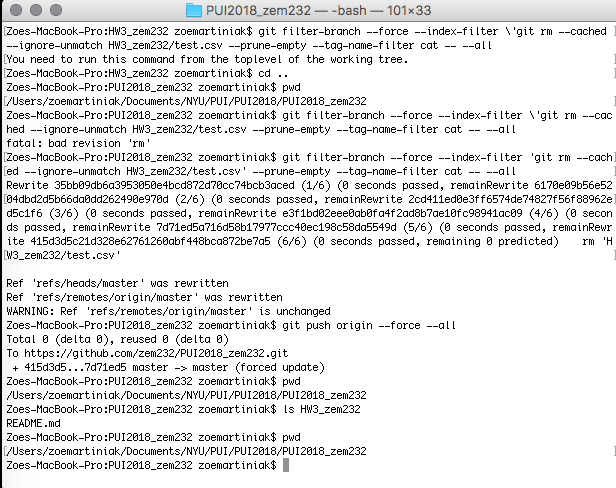

# PUI2018 - ASSIGNMENT 3 - ZEM232
All files in this repo are part of my HW#3 submission

## Part 1: deleteData.md
I created the file test.csv with three data entries in my local directory.
This file was pushed to GitHub to my HW3_zem232 repository...

... further proof shown by the GitHub commit timestamp:

This file was then permanently removed from my GitHub repository through the following bash shell code:

## Part 2: 
Part two of the assignment was written in the Jupyter notebook in this repo, titled: 
HW3_zem232_Part2.ipynb 

## Part 3: 
Part three of the assignment extracts real-time MTA bus information using the SIRI API, and can be found in this repo as the Python script titled:
show_bus_locations_zem_232.py 

## Part 4: 
Part four of the assient extracts real-time MTA bus information using the SIRI API, and writes bus location and status to a .csv. This Python script is in this repo titled:
get_bus_info_zem_232.py 
